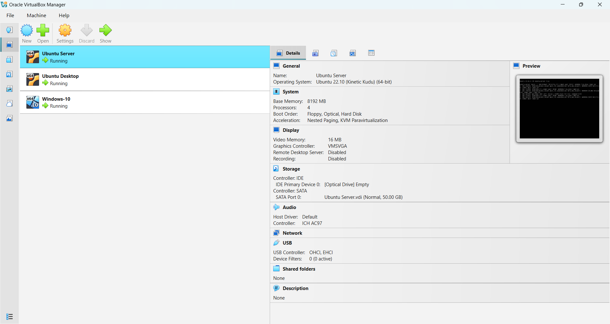
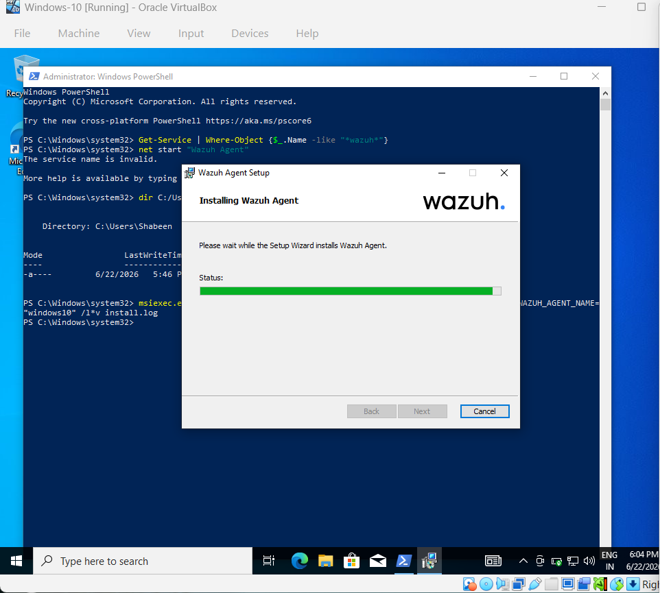
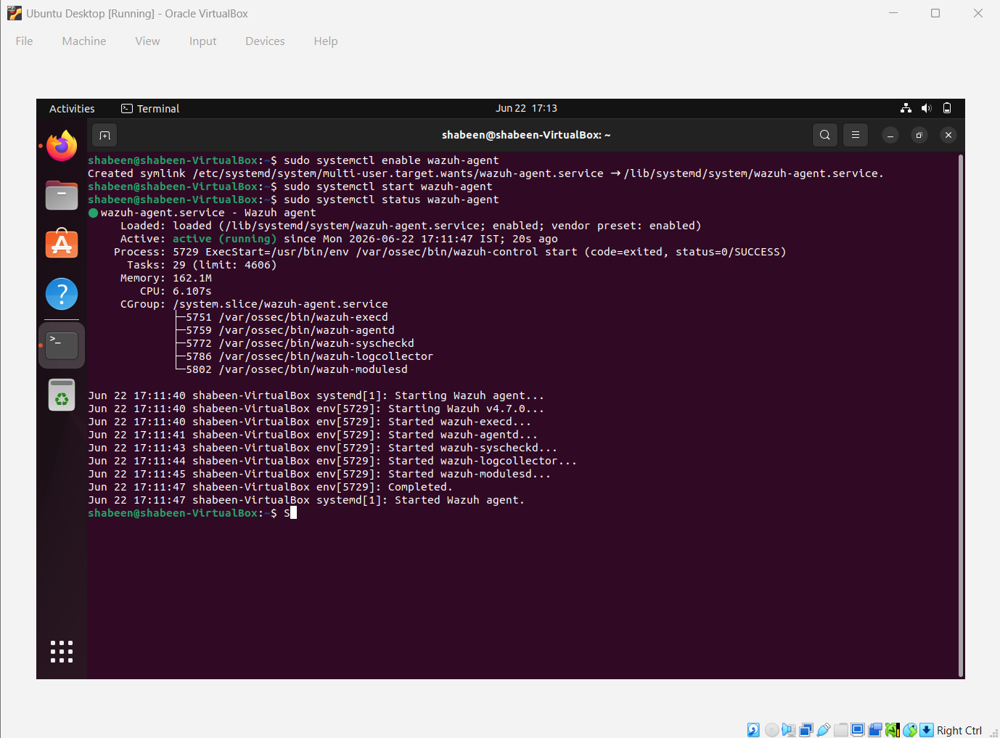
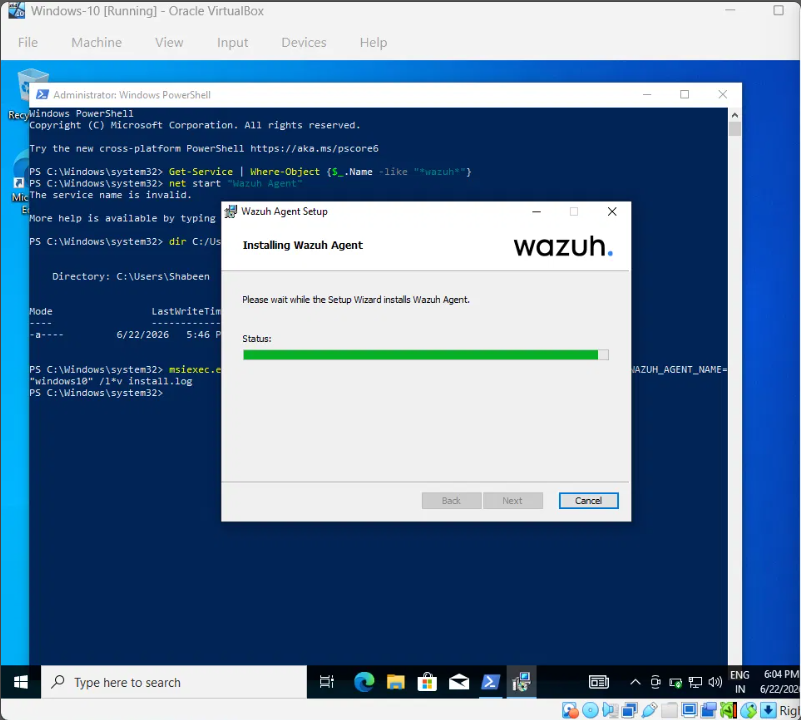
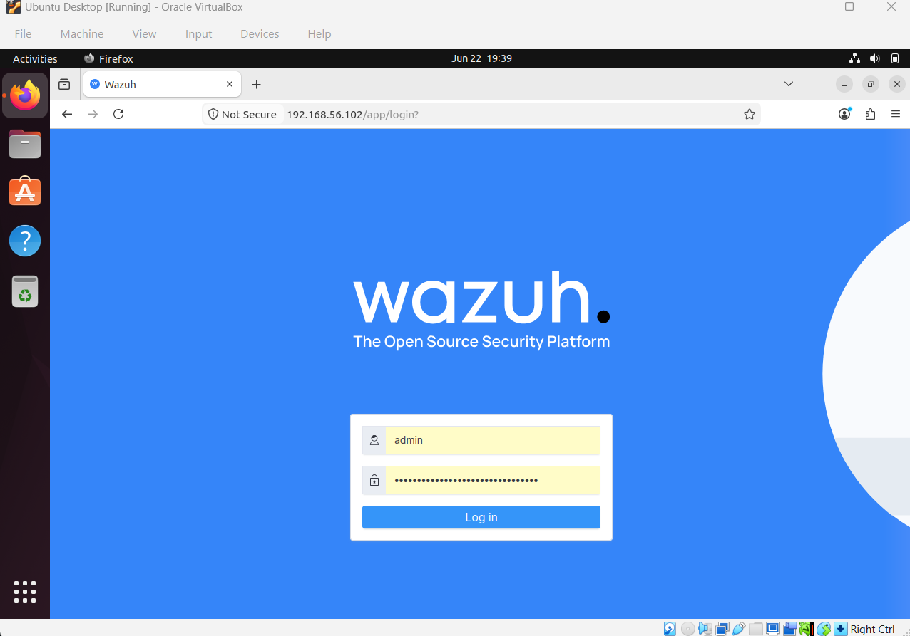

# SOC Homelab Project — Wazuh SIEM


## 1. Project Overview
A Security Operations Center (SOC) homelab built using Wazuh 4.7 SIEM to simulate real-world threat detection and incident response across multiple endpoints.

**Project Goals:**
- Deploy a fully functional SIEM in a homelab environment
- Monitor multiple endpoints (Linux + Windows)
- Simulate real-world attacks and detect them
- Investigate alerts using MITRE ATT&CK framework
- Build hands-on SOC analyst skills

**Duration:** June 2026  
**Difficulty:** Beginner to Intermediate  
**Type:** Blue Team / Defensive Security

---

## 2. Lab Architecture

### Overview
Three virtual machines connected on a Host-Only network.
Ubuntu Server acts as the SIEM brain. Ubuntu Desktop and 
Windows 10 act as monitored endpoints.

---

## 3. Prerequisites

### Host Machine Requirements
| Component | Minimum | Recommended |
|---|---|---|
| RAM | 12 GB | 16 GB |
| Storage | 150 GB free | 200 GB SSD |
| OS | Windows 10 | Windows 11 |
| CPU | 4 cores | 6+ cores |

### Software Required
| Software | Purpose | Download |
|---|---|---|
| Oracle VirtualBox 7.x | Hypervisor | [virtualbox.org](https://www.virtualbox.org) |
| Ubuntu Server 22.04 LTS | Wazuh SIEM server | [ubuntu.com](https://ubuntu.com/download/server) |
| Ubuntu Desktop 22.04 | Agent + attacker | [ubuntu.com](https://ubuntu.com/download/desktop) |
| Windows 10 | Agent + victim | [microsoft.com](https://www.microsoft.com) |

### Knowledge Required
- Basic Linux command line
- Basic networking (IP, ports, protocols)
- Basic understanding of SIEM concepts
- Basic Windows PowerShell

---

## 4. Network Topology

┌──────────────────────────────────────────────────────┐

│           Oracle VirtualBox — Host Machine            │

│                  Windows 11 Host                      │

│                   RAM: 15.6 GB                        │

│                                                       │

│       Host-Only Network: 192.168.56.0/24             │

│                                                       │

│  ┌───────────────┐        ┌───────────────┐          │

│  │Ubuntu Desktop │        │  Windows 10   │          │

│  │192.168.56.103 │        │192.168.56.104 │          │

│  │  Agent 001    │        │  Agent 002    │          │

│  │  RAM: 2GB     │        │  RAM: 2GB     │          │

│  └───────┬───────┘        └───────┬───────┘          │

│          │                        │                   │

│          │    logs + alerts        │                   │

│          └──────────┬─────────────┘                   │

│                     │ Port 1514/TCP                   │

│                     ▼                                 │

│          ┌──────────────────────┐                     │

│          │    Ubuntu Server     │                     │

│          │   192.168.56.102     │                     │

│          │   RAM: 8GB  CPU: 4   │                     │

│          │  ┌────────────────┐  │                     │

│          │  │ Wazuh Manager  │  │                     │

│          │  ├────────────────┤  │                     │

│          │  │ Wazuh Indexer  │  │                     │

│          │  ├────────────────┤  │                     │

│          │  │Wazuh Dashboard │  │                     │

│          │  └────────────────┘  │                     │

│          └──────────────────────┘                     │

└──────────────────────────────────────────────────────┘

---

## 5. Virtual Machine Details

| Machine | OS | Role | IP | RAM | CPU | Storage |
|---|---|---|---|---|---|---|
| Ubuntu Server | Ubuntu 22.04 LTS | Wazuh Manager + Indexer + Dashboard | 192.168.56.102 | 8 GB | 4 cores | 50 GB |
| Ubuntu Desktop | Ubuntu 22.04 Desktop | Wazuh Agent + Attack Machine | 192.168.56.103 | 2 GB | 1 core | 25 GB |
| Windows 10 | Windows 10 Pro | Wazuh Agent + Victim Machine | 192.168.56.104 | 2 GB | 1 core | 50 GB |

---

## 6. Wazuh Components

| Component | Machine | Port | Purpose |
|---|---|---|---|
| Wazuh Manager | Ubuntu Server | 1514, 1515 | Receives logs, applies rules, generates alerts |
| Wazuh Indexer | Ubuntu Server | 9200, 9300 | Stores and indexes alert data (OpenSearch) |
| Wazuh Dashboard | Ubuntu Server | 443 | Web UI for alert visualization |
| Wazuh Agent 001 | Ubuntu Desktop | - | Collects Linux logs, forwards to manager |
| Wazuh Agent 002 | Windows 10 | - | Collects Windows Event logs, forwards to manager |

---

## 7. Network Configuration

| Port | Protocol | Direction | Purpose |
|---|---|---|---|
| 1514 | TCP | Agent → Manager | Agent log forwarding |
| 1515 | TCP | Agent → Manager | Agent auto-registration |
| 443 | HTTPS | Browser → Dashboard | Wazuh web UI access |
| 9200 | HTTPS | Internal | OpenSearch REST API |
| 9300 | TCP | Internal | OpenSearch cluster |
| 22 | TCP | Desktop → Server | SSH administration |

---

## 8. Project Setup

### Step 1 — Install Wazuh on Ubuntu Server
```bash
curl -O https://packages.wazuh.com/4.7/wazuh-install.sh
sudo bash ~/wazuh-install.sh -a
```

### Step 2 — Access Dashboard

https://192.168.56.102

Username: admin

Password: (generated during install)

### Step 3 — Install Agent on Ubuntu Desktop
```bash
wget https://packages.wazuh.com/4.x/apt/pool/main/w/wazuh-agent/wazuh-agent_4.7.0-1_amd64.deb

sudo WAZUH_MANAGER='192.168.56.102' dpkg -i ./wazuh-agent_4.7.0-1_amd64.deb

sudo systemctl daemon-reload
sudo systemctl enable wazuh-agent
sudo systemctl start wazuh-agent
```

### Step 4 — Install Agent on Windows 10
```powershell
Invoke-WebRequest -Uri "https://packages.wazuh.com/4.x/windows/wazuh-agent-4.7.0-1.msi" -OutFile "wazuh-agent.msi"

msiexec.exe /i wazuh-agent.msi WAZUH_MANAGER="192.168.56.102" WAZUH_AGENT_NAME="windows10"

Start-Service WazuhSvc
```

### Step 5 — Verify Agents Connected
```bash
sudo /var/ossec/bin/agent_control -l
```

---

## 9. Attack Simulations

### Attack 1 — SSH Brute Force
```bash
# Create password list
cat << 'EOF' > ~/passwords.txt
password
123456
admin
ubuntu
root
password123
EOF

# Run brute force
hydra -l ubuntu -P ~/passwords.txt -t 4 ssh://192.168.56.102
```
- **Tool:** Hydra
- **Target:** Ubuntu Server SSH
- **Wazuh Rule:** 5763
- **MITRE:** T1110 — Brute Force
- **Result:** Detected ✅

---

### Attack 2 — Nmap Port Scan
```bash
# Basic scan
nmap -sV 192.168.56.102

# Aggressive scan
nmap -A -O 192.168.56.102

# Scan Windows 10
nmap -sV 192.168.56.104
```
- **Tool:** Nmap
- **Target:** Ubuntu Server + Windows 10
- **Wazuh Rule:** 40101
- **MITRE:** T1046 — Network Service Scanning
- **Result:** Detected ✅

---

### Attack 3 — Windows Failed Logon
```powershell
$i = 0
while ($i -lt 10) {
    net use \\localhost\IPC$ /user:fakeadmin wrongpassword 2>$null
    $i++
}
```
- **Tool:** PowerShell
- **Target:** Windows 10
- **Windows Event ID:** 4625
- **Wazuh Rule:** 60122
- **MITRE:** T1078 — Valid Accounts
- **Result:** Detected ✅

---

### Attack 4 — File Integrity Monitoring
```bash
sudo touch /etc/malware-test.txt
sudo echo "backdoor" > /etc/malware-test.txt
sudo echo "# hacked" >> /etc/hosts
```
- **Method:** File creation and modification in /etc
- **Wazuh Rule:** 550, 554
- **MITRE:** T1565 — Data Manipulation
- **Result:** Detected ✅

---

## 10. Alerts Detected

| Attack | Rule ID | MITRE Technique | Tactic | Level |
|---|---|---|---|---|
| SSH Brute Force | 5763 | T1110 | Credential Access | 10 |
| Port Scan | 40101 | T1046 | Reconnaissance | 6 |
| Windows Logon Failure | 60122 | T1078 | Initial Access | 5 |
| File Integrity | 550/554 | T1565 | Impact | 7 |
| PAM Login Session | 5501 | T1078 | Defense Evasion | 3 |
| Service Startup Change | 61104 | T1543 | Persistence | 3 |

---

## 11. MITRE ATT&CK Coverage

| Tactic | Technique | ID | Detected By |
|---|---|---|---|
| Reconnaissance | Network Service Scanning | T1046 | Nmap scan alerts |
| Credential Access | Brute Force | T1110 | SSH brute force |
| Initial Access | Valid Accounts | T1078 | Windows logon failure |
| Defense Evasion | Valid Accounts | T1078 | PAM session events |
| Persistence | Create or Modify System Process | T1543 | Service startup change |
| Impact | Data Manipulation | T1565 | File integrity monitoring |

---

## 12. Challenges Faced

| Challenge | Root Cause | Solution |
|---|---|---|
| Wazuh indexer failed to start | Insufficient VM RAM (2GB) | Increased Ubuntu Server RAM to 8GB |
| Dashboard crashing during attacks | Memory pressure | Created 4GB swap file |
| curl download failing | URL typo — period instead of slash | Typed URL manually |
| Agent not registering | MSI install incomplete | Reinstalled via GUI wizard |
| rockyou.txt not found | Wordlists not installed | Created custom password list |
| Windows cursor frozen | VirtualBox mouse capture | Pressed Right Ctrl to release |
| Dashboard showing "not ready" | Services stopped after RAM pressure | Restarted all Wazuh services in order |

---

## 13. Key Learnings

- Deployed and configured enterprise-grade SIEM (Wazuh 4.7)
- Installed and managed agents on Linux and Windows endpoints
- Performed real-time threat detection and alert analysis
- Mapped detected threats to MITRE ATT&CK framework
- Investigated forensic details of security alerts
- Performed Windows Event ID correlation (4624, 4625)
- Troubleshot VM networking and service configuration issues
- Wrote and tested custom Wazuh detection rules
- Understood log flow from endpoint to SIEM to dashboard

---

## 14. Screenshots
### Step 3 — Install Agent on Ubuntu Desktop
```bash
wget https://packages.wazuh.com/4.x/apt/pool/main/w/wazuh-agent/wazuh-agent_4.7.0-1_amd64.deb

sudo WAZUH_MANAGER='192.168.56.102' dpkg -i ./wazuh-agent_4.7.0-1_amd64.deb

sudo systemctl daemon-reload
sudo systemctl enable wazuh-agent
sudo systemctl start wazuh-agent
```

### Step 4 — Install Agent on Windows 10
```powershell
Invoke-WebRequest -Uri "https://packages.wazuh.com/4.x/windows/wazuh-agent-4.7.0-1.msi" -OutFile "wazuh-agent.msi"

msiexec.exe /i wazuh-agent.msi WAZUH_MANAGER="192.168.56.102" WAZUH_AGENT_NAME="windows10"

Start-Service WazuhSvc
```

### Step 5 — Verify Agents Connected
```bash
sudo /var/ossec/bin/agent_control -l
```

---

## 9. Attack Simulations

### Attack 1 — SSH Brute Force
```bash
# Create password list
cat << 'EOF' > ~/passwords.txt
password
123456
admin
ubuntu
root
password123
EOF

# Run brute force
hydra -l ubuntu -P ~/passwords.txt -t 4 ssh://192.168.56.102
```
- **Tool:** Hydra
- **Target:** Ubuntu Server SSH
- **Wazuh Rule:** 5763
- **MITRE:** T1110 — Brute Force
- **Result:** Detected ✅

---

### Attack 2 — Nmap Port Scan
```bash
# Basic scan
nmap -sV 192.168.56.102

# Aggressive scan
nmap -A -O 192.168.56.102

# Scan Windows 10
nmap -sV 192.168.56.104
```
- **Tool:** Nmap
- **Target:** Ubuntu Server + Windows 10
- **Wazuh Rule:** 40101
- **MITRE:** T1046 — Network Service Scanning
- **Result:** Detected ✅

---

### Attack 3 — Windows Failed Logon
```powershell
$i = 0
while ($i -lt 10) {
    net use \\localhost\IPC$ /user:fakeadmin wrongpassword 2>$null
    $i++
}
```
- **Tool:** PowerShell
- **Target:** Windows 10
- **Windows Event ID:** 4625
- **Wazuh Rule:** 60122
- **MITRE:** T1078 — Valid Accounts
- **Result:** Detected ✅

---

### Attack 4 — File Integrity Monitoring
```bash
sudo touch /etc/malware-test.txt
sudo echo "backdoor" > /etc/malware-test.txt
sudo echo "# hacked" >> /etc/hosts
```
- **Method:** File creation and modification in /etc
- **Wazuh Rule:** 550, 554
- **MITRE:** T1565 — Data Manipulation
- **Result:** Detected ✅

---

## 10. Alerts Detected

| Attack | Rule ID | MITRE Technique | Tactic | Level |
|---|---|---|---|---|
| SSH Brute Force | 5763 | T1110 | Credential Access | 10 |
| Port Scan | 40101 | T1046 | Reconnaissance | 6 |
| Windows Logon Failure | 60122 | T1078 | Initial Access | 5 |
| File Integrity | 550/554 | T1565 | Impact | 7 |
| PAM Login Session | 5501 | T1078 | Defense Evasion | 3 |
| Service Startup Change | 61104 | T1543 | Persistence | 3 |

---

## 11. MITRE ATT&CK Coverage

| Tactic | Technique | ID | Detected By |
|---|---|---|---|
| Reconnaissance | Network Service Scanning | T1046 | Nmap scan alerts |
| Credential Access | Brute Force | T1110 | SSH brute force |
| Initial Access | Valid Accounts | T1078 | Windows logon failure |
| Defense Evasion | Valid Accounts | T1078 | PAM session events |
| Persistence | Create or Modify System Process | T1543 | Service startup change |
| Impact | Data Manipulation | T1565 | File integrity monitoring |

---

## 12. Challenges Faced

| Challenge | Root Cause | Solution |
|---|---|---|
| Wazuh indexer failed to start | Insufficient VM RAM (2GB) | Increased Ubuntu Server RAM to 8GB |
| Dashboard crashing during attacks | Memory pressure | Created 4GB swap file |
| curl download failing | URL typo — period instead of slash | Typed URL manually |
| Agent not registering | MSI install incomplete | Reinstalled via GUI wizard |
| rockyou.txt not found | Wordlists not installed | Created custom password list |
| Windows cursor frozen | VirtualBox mouse capture | Pressed Right Ctrl to release |
| Dashboard showing "not ready" | Services stopped after RAM pressure | Restarted all Wazuh services in order |

---

## 13. Key Learnings

- Deployed and configured enterprise-grade SIEM (Wazuh 4.7)
- Installed and managed agents on Linux and Windows endpoints
- Performed real-time threat detection and alert analysis
- Mapped detected threats to MITRE ATT&CK framework
- Investigated forensic details of security alerts
- Performed Windows Event ID correlation (4624, 4625)
- Troubleshot VM networking and service configuration issues
- Wrote and tested custom Wazuh detection rules
- Understood log flow from endpoint to SIEM to dashboard

---

## 14. Screenshots

### 1. VirtualBox Lab Setup — All 3 VMs Running


### 2. Wazuh Installation Complete


### 3. Ubuntu Desktop Agent Active


### 4. Windows 10 Agent Installation


### 5. Wazuh Dashboard Login


### 6. First Agent Connected


### 7. Both Agents Active


### 8. Live Security Events — 30 Hits


### 9. MITRE ATT&CK Dashboard


### 10. Security Alerts Table


### 11. Windows Logon Failure Detection


### 12. Forensic Alert Investigation


---

## 15. References

- [Wazuh Official Documentation](https://documentation.wazuh.com)
- [Wazuh Installation Guide](https://documentation.wazuh.com/current/installation-guide)
- [MITRE ATT&CK Framework](https://attack.mitre.org)
- [VirtualBox Documentation](https://www.virtualbox.org/wiki/Documentation)
- [Ubuntu Server Download](https://ubuntu.com/download/server)
- [Windows Event IDs Reference](https://www.ultimatewindowssecurity.com/securitylog/encyclopedia)

---

## Author
**Shabeen**  
Cybersecurity Fresher | SOC Analyst Aspirant  
[LinkedIn](https://linkedin.com/in/yourprofile) | 
[GitHub](https://github.com/yourusername)

---

## 15. References

- [Wazuh Official Documentation](https://documentation.wazuh.com)
- [Wazuh Installation Guide](https://documentation.wazuh.com/current/installation-guide)
- [MITRE ATT&CK Framework](https://attack.mitre.org)
- [VirtualBox Documentation](https://www.virtualbox.org/wiki/Documentation)
- [Ubuntu Server Download](https://ubuntu.com/download/server)
- [Windows Event IDs Reference](https://www.ultimatewindowssecurity.com/securitylog/encyclopedia)

---

## Author
**Shabeen**  
Cybersecurity Fresher | SOC Analyst Aspirant  
[LinkedIn](https://linkedin.com/in/shabeen-begum-s) | 
[GitHub](https://github.com/shabeenshafi26)
